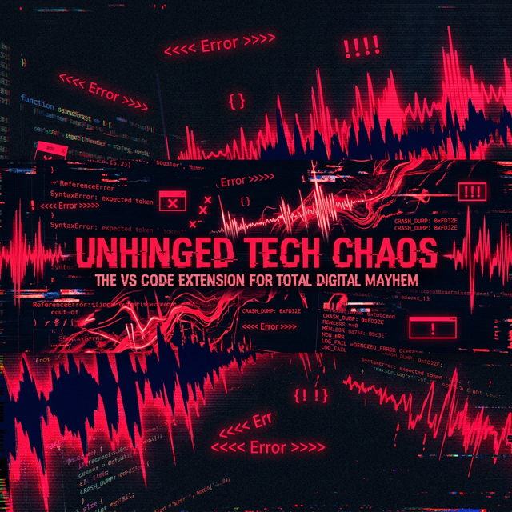

<p align="center">
  
</p>

<p align="center">
  <a href="https://marketplace.visualstudio.com/items?itemName=tanmoy-debnath.faaaaaahhh">
    
  </a>
  <a href="https://marketplace.visualstudio.com/items?itemName=tanmoy-debnath.faaaaaahhh">
    
  </a>
  <a href="LICENSE">
    
  </a>
  <a href="https://www.buymeacoffee.com/tanmoydn">
    
  </a>
</p>

---
## What is this

A Visual Studio Code extension that plays the **FAAAH** meme sound every time an error appears in your editor. Warnings get a softer **AA** instead.

Every error source VS Code exposes is covered: red squiggles, failed build tasks, crashed debug sessions, and mistyped terminal commands. If your code is broken, you will hear about it.

**v0.2.0 adds:**

- **Volume control** — slider in the Settings Panel (0–100%). Works on Windows, macOS, and Linux
- **Live error count in status bar** — shows `$(error)N` next to the FAAAH toggle when errors exist
- **Victory sound off by default** — opt-in via Settings Panel if you want it

**v0.1.0 adds:**

- **Severity tiers** — syntax typos play a calm sound; dropping 5 errors at once plays something louder
- **Terminal mistype sound** — wrong command in the terminal? You'll hear that too
- **Custom sound folders** — drop your own WAV files in a folder; the extension picks one at random per event
- **Quiet hours** — mute sounds between configurable hours (e.g. 09:00–17:00 in meetings)
- **Error streak toast** — consecutive errors with no fixes trigger a shame notification
- **Sound packs** — switch between `meme`, `rage`, and `chill` packs via Quick Pick
- **Settings Panel** — a UI to configure every sound slot without touching `settings.json`

---

## How it works

<p align="center">
  
</p>

The extension registers listeners across four VS Code event channels:

| Source | API | Trigger |
|---|---|---|
| Diagnostic errors | `onDidChangeDiagnostics` | New error count exceeds previous for a URI |
| Diagnostic warnings | `onDidChangeDiagnostics` | New warning count exceeds previous for a URI |
| Task failures | `onDidEndTaskProcess` | Task exits with non-zero code |
| Debug crashes | `onDidTerminateDebugSession` | Debug session terminates unexpectedly |
| Terminal mistype | `onDidEndTerminalShellExecution` | Shell command exits with non-zero code |

When an event fires, the sound player resolves the correct `.wav` file and spawns an OS-level process to play it. The process is detached — sounds overlap naturally, one per event.

### Sound tier system

The diagnostic watcher batches all URIs in a single event and uses the largest delta to pick a tier:

```
1 new error  →  tier 1  →  faaah-easy.wav  (syntax typo, chill)
2–4 new      →  tier 2  →  faah-mid.wav    (something broke)
5+ new       →  tier 3  →  faah-high.wav   (absolute chaos)

Syntax error (TS 1000–1999 codes, "expected", "unterminated" etc.)
             →  always tier 1 regardless of count
```

Warning tiers follow the same pattern with `aa-low.wav` and `aa-high.wav`.

### Sound resolution order (per slot)

```
customSoundFolder (random .wav)
  └─ customSoundPath / tier override (single file)
       └─ sound pack file (media/<pack>/<file>.wav)
            └─ built-in bundled fallback (media/<file>.wav)
```

---

## Install

**Marketplace**

1. Open the Extensions panel (`Ctrl+Shift+X`)
2. Search `Faaaaaahhh`
3. Install

**Manual**

```
code --install-extension faaaaaahhh-0.2.2.vsix
```

---

## Usage

Write code. If the code is bad, you will hear it.

### Commands

Open the Command Palette (`Ctrl+Shift+P`):

| Command | Description |
|---|---|
| `Faaaaaahhh: Toggle Sound On/Off` | Enable or disable all sounds |
| `Faaaaaahhh: Test Error Sound (FAAAH)` | Play the tier-1 error sound |
| `Faaaaaahhh: Test Warning Sound (AA)` | Play the tier-1 warning sound |
| `Faaaaaahhh: Test Victory Sound` | Play the victory sound |
| `Faaaaaahhh: Open Settings Panel` | Open the graphical settings UI |
| `Faaaaaahhh: Switch Sound Pack` | Pick `meme`, `rage`, or `chill` via Quick Pick |

### Settings Panel

`Faaaaaahhh: Open Settings Panel` opens a webview with live controls:

- Master switches for errors, warnings, victory, terminal sounds
- Volume slider (0–100%) with live preview
- Cooldown slider (0–10 000 ms) with live preview
- Error streak shame threshold
- Quiet hours time pickers
- Custom WAV path inputs for every sound slot (tier 1/2/3, warning tier 1/2, victory, terminal)

Changes apply to your global VS Code settings instantly.

### Status Bar

A **FAAAH** button sits in the bottom-right status bar. Click it to toggle on/off.

- `$(unmute) FAAAH` — sounds active, no errors
- `$(unmute) FAAAH  $(error)5` — sounds active, 5 errors in workspace
- `$(mute) FAAAH` — sounds disabled
- `$(mute) FAAAH (quiet)` — quiet hours are currently active

---

## Configuration

All settings live under `faaaaaahhh.*` in VS Code settings (`Ctrl+,`).

### General

| Setting | Type | Default | Description |
|---|---|---|---|
| `faaaaaahhh.enabled` | `boolean` | `true` | Master switch for all sounds |
| `faaaaaahhh.warningsEnabled` | `boolean` | `true` | Play AA sound on new warnings |
| `faaaaaahhh.victoryEnabled` | `boolean` | `false` | Play victory sound when a file's errors drop to zero |
| `faaaaaahhh.terminalSoundEnabled` | `boolean` | `true` | Play sound when a terminal command fails |
| `faaaaaahhh.volume` | `number` | `100` | Playback volume for all sounds (0–100) |
| `faaaaaahhh.cooldownMs` | `number` | `0` | Minimum ms between sounds per kind. `0` = instant overlap |
| `faaaaaahhh.soundPack` | `string` | `"meme"` | Active pack: `meme`, `rage`, or `chill` |
| `faaaaaahhh.streakThresholdToast` | `number` | `10` | Consecutive errors before showing the shame notification |

### Quiet Hours

| Setting | Type | Default | Description |
|---|---|---|---|
| `faaaaaahhh.quietHoursStart` | `string` | `""` | Start of silent window in 24h format, e.g. `"22:00"` |
| `faaaaaahhh.quietHoursEnd` | `string` | `""` | End of silent window, e.g. `"08:00"`. Supports overnight ranges. |

### Custom Sound Paths

| Setting | Type | Default | Description |
|---|---|---|---|
| `faaaaaahhh.customSoundFolder` | `string` | `""` | Folder of `.wav` files. A random file is picked per error event. Overrides tiers. |
| `faaaaaahhh.customSoundPath` | `string` | `""` | Single `.wav` for all errors (legacy override) |
| `faaaaaahhh.errorTierSounds` | `object` | `{}` | Per-tier WAV paths: `{ "tier1": "", "tier2": "", "tier3": "" }` |
| `faaaaaahhh.customWarningSoundFolder` | `string` | `""` | Folder of `.wav` files for warnings. Random pick per event. |
| `faaaaaahhh.customWarningSoundPath` | `string` | `""` | Single `.wav` for all warnings (legacy override) |
| `faaaaaahhh.warningTierSounds` | `object` | `{}` | Per-tier WAV paths: `{ "tier1": "", "tier2": "" }` |
| `faaaaaahhh.customVictoryPath` | `string` | `""` | Custom `.wav` for the victory sound |
| `faaaaaahhh.customTerminalSoundPath` | `string` | `""` | Custom `.wav` for terminal mistype sounds |

---

## Bundled sounds

| File | Plays when |
|---|---|
| `faaah-easy.wav` | Syntax error, or 1 new error |
| `faah-mid.wav` | 2–4 new errors at once |
| `faah-high.wav` | 5+ new errors at once |
| `faah.wav` | Ultimate fallback for all error tiers |
| `aa-low.wav` | 1 new warning |
| `aa-high.wav` | 2+ new warnings at once |
| `aa.wav` | Fallback for all warning tiers |
| `victory.wav` | All errors in a file fixed |
| `ahhhh.wav` | Terminal command failed / not recognized |

---

## Platform support

| Platform | Audio backend | Notes |
|---|---|---|
| Windows | `powershell -File play.ps1` | Volume < 100%: Windows Media Player COM. Volume = 100%: `SoundPlayer` (faster). |
| macOS | `afplay -v` | Native. No dependencies. Volume passed as `0.00–1.00`. |
| Linux | `paplay --volume` → `aplay` | Volume passed as `0–65536`. Falls back to `aplay` (no volume) if PulseAudio unavailable. |

---

## Project structure

```
faaaaaahhh/
  src/
    extension.ts               Entry point. Commands, status bar, watcher registration.
    config.ts                  Reads workspace configuration into typed interface.
    player/
      soundPlayer.ts           Tier resolution, quiet hours, cooldown, OS dispatch.
    watchers/
      diagnosticWatcher.ts     Batched error/warning tracking with tier + streak logic.
      taskWatcher.ts           Non-zero task exit codes.
      debugWatcher.ts          Debug session termination.
      terminalWatcher.ts       Shell command exit codes (VS Code 1.93+) with fallback.
    webview/
      settingsPanel.ts         Graphical settings panel (singleton webview).
  media/
    faaah-easy.wav             Tier 1 / syntax error sound.
    faah-mid.wav               Tier 2 error sound.
    faah-high.wav              Tier 3 error sound.
    faah.wav                   Error fallback.
    aa-low.wav                 Warning tier 1.
    aa-high.wav                Warning tier 2.
    aa.wav                     Warning fallback.
    victory.wav                All-errors-fixed sound.
    ahhhh.wav                  Terminal mistype sound.
    play.ps1                   Windows PowerShell audio helper.
  assets/
    hero-banner.png            Repository banner.
    architecture.png           Architecture diagram.
  dist/
    extension.js               Bundled output (esbuild).
```

---

## Development

### Prerequisites

- Node.js 18+
- VS Code 1.85+

### Build

```bash
npm install
npm run build
```

### Test locally

1. Open the project in VS Code
2. Press `F5` to launch the Extension Development Host
3. In the new window, open any project and introduce errors
4. Check the **Output** panel (channel: `Faaaaaahhh`) for debug logs

### Package

```bash
npx @vscode/vsce package
```

---

## How the diff engine works

The diagnostic watcher tracks the error and warning count per file URI across events. A sound only plays when the count **increases**. The batch across all URIs in one event picks the largest delta to determine the tier.

```typescript
// Simplified — see diagnosticWatcher.ts for full logic
for (const uri of event.uris) {
  const errorCount = diagnostics.filter(d => d.severity === Error).length;
  const delta = errorCount - (previousErrorCounts.get(key) ?? 0);
  if (delta > 0) maxNewErrors = Math.max(maxNewErrors, delta);
}

// One sound per event batch — tier driven by worst delta
playSound(context, "error", maxNewErrors);  // 1 → tier1, 2-4 → tier2, 5+ → tier3
```

This means:
- Opening a file with 10 existing errors → no sound
- Adding one new error to that file → tier 1 sound
- Adding 5 errors in one save → tier 3 sound
- Fixing errors → no sound (but zero-out triggers victory)
- Re-saving without changes → no sound

---

## FAQ

**Does this work with Python / Rust / Go / Java / ESLint / any linter?**
If VS Code can produce diagnostics for it, this extension reacts to it. Language-agnostic by design.

**Can I use my own sounds?**
Yes — multiple ways. Set individual tier paths in the Settings Panel, point `customSoundFolder` to a folder of WAV files for random picks, or use `customSoundPath` for a single override. The Settings Panel UI (`Ctrl+Shift+P` → "Open Settings Panel") handles it without editing JSON.

**The overlapping is too much.**
Open the Settings Panel and drag the cooldown slider up. `3000 ms` gives a 3-second grace period between sounds of the same kind.

**Does this fire for every keystroke?**
No. The diagnostic watcher only fires when the count for a file *increases*. Typing without introducing new errors produces no sound.

**Can I silence it during work hours?**
Yes. Set quiet hours in the Settings Panel (From / To time pickers). The status bar shows `(quiet)` when active. Supports overnight ranges (e.g. 22:00 to 07:00).

**Does this use AI?**
No. It is an event listener and a WAV file.

---

## License

[MIT](LICENSE)

---

<p align="center">
  <sub>Built at 3 AM by someone who should have been fixing bugs instead of adding sound effects to them.</sub>
</p>
