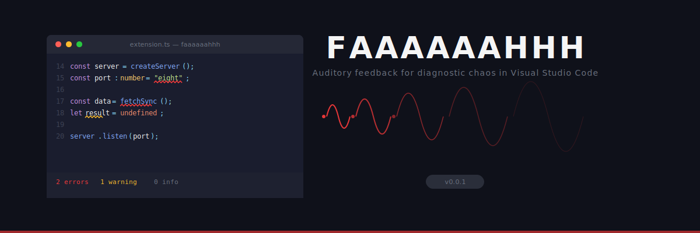

<p align="center">
  
</p>

<p align="center">
  <a href="https://marketplace.visualstudio.com/items?itemName=tanmoy-debnath.faaaaaahhh">
    
  </a>
  <a href="https://marketplace.visualstudio.com/items?itemName=tanmoy-debnath.faaaaaahhh">
    
  </a>
  <a href="LICENSE">
    
  </a>
</p>

---

## What is this

A Visual Studio Code extension that plays the **FAAAH** meme sound every time an error appears in your editor. Warnings get a softer **AA** instead.

Every error source VS Code exposes is covered: red squiggly underlines, failed build tasks, crashed debug sessions. If your code is broken, you will hear about it.

The sounds overlap by default. Five errors at once means five simultaneous FAAAH sounds layered on top of each other. This is intentional.

---

## How it works

<p align="center">
  
</p>

The extension registers listeners on three VS Code event channels:

| Source | API | Trigger |
|---|---|---|
| Diagnostic errors | `onDidChangeDiagnostics` | New error count exceeds previous count for a given URI |
| Task failures | `onDidEndTaskProcess` | Task exits with non-zero code |
| Debug crashes | `onDidTerminateDebugSession` | Debug session terminates |
| Warnings | `onDidChangeDiagnostics` | New warning count exceeds previous for a given URI |

When an event fires, the sound player spawns an independent OS-level process to play the `.wav` file. Each sound runs in its own process — no queue, no cancellation, no mercy.

```
error 1:  FAAAAAAHHH---------------------
error 2:    FAAAAAAHHH-------------------
error 3:      FAAAAAAHHH-----------------
error 4:        FAAAAAAHHH---------------
error 5:          FAAAAAAHHH-------------
```

---

## Install

**Marketplace**

1. Open the Extensions panel (`Ctrl+Shift+X`)
2. Search `Faaaaaahhh`
3. Install

**Manual**

```
code --install-extension faaaaaahhh-0.0.1.vsix
```

---

## Usage

Write code. If the code is bad, you will hear it.

### Commands

Open the Command Palette (`Ctrl+Shift+P`):

| Command | Description |
|---|---|
| `Faaaaaahhh: Toggle Sound On/Off` | Enable or disable all sounds |
| `Faaaaaahhh: Test Error Sound (FAAAH)` | Play the error sound once |
| `Faaaaaahhh: Test Warning Sound (AA)` | Play the warning sound once |

### Status Bar

A **FAAAH** button sits in the bottom-right status bar. Click it to toggle on/off. The icon switches between `unmute` and `mute` to reflect the current state.

---

## Configuration

All settings live under `faaaaaahhh.*` in your VS Code settings.

| Setting | Type | Default | Description |
|---|---|---|---|
| `faaaaaahhh.enabled` | `boolean` | `true` | Master switch for all sounds |
| `faaaaaahhh.warningsEnabled` | `boolean` | `true` | Play AA on warnings |
| `faaaaaahhh.cooldownMs` | `number` | `0` | Minimum ms between sounds. `0` = no cooldown, full overlap |
| `faaaaaahhh.customSoundPath` | `string` | `""` | Absolute path to a custom `.wav` for errors |
| `faaaaaahhh.customWarningSoundPath` | `string` | `""` | Absolute path to a custom `.wav` for warnings |

**Overlap behavior**: With `cooldownMs` set to `0` (default), every new error spawns its own audio process immediately. Set it to `3000` or higher if you want a grace period between sounds.

**Custom sounds**: Point `customSoundPath` to any `.wav` file on your system. The extension does not transcode — the file must be a valid WAV.

---

## Platform support

| Platform | Audio backend | Notes |
|---|---|---|
| Windows | `powershell -File play.ps1` | Uses `System.Media.SoundPlayer`. Each sound is a separate PowerShell process. |
| macOS | `afplay` | Native. No dependencies. |
| Linux | `paplay` / `aplay` | Falls back to `aplay` if PulseAudio is unavailable. |

---

## Project structure

```
faaaaaahhh/
  src/
    extension.ts               Entry point. Registers watchers, commands, status bar.
    config.ts                  Reads workspace configuration.
    player/
      soundPlayer.ts           Cross-platform audio playback. Process-per-sound.
    watchers/
      diagnosticWatcher.ts     Tracks error/warning counts per URI. Fires on increase.
      taskWatcher.ts           Listens for non-zero task exit codes.
      debugWatcher.ts          Listens for debug session termination.
  media/
    faah.wav                   Default error sound.
    aa.wav                     Default warning sound.
    play.ps1                   Windows helper script for PowerShell playback.
  assets/
    hero-banner.svg            Repository banner.
    architecture.svg           Architecture diagram.
  dist/
    extension.js               Bundled output (esbuild).
```

---

## Development

### Prerequisites

- Node.js 18+
- VS Code 1.85+

### Build

```bash
npm install
npm run build
```

### Test locally

1. Open the project in VS Code
2. Press `F5` to launch the Extension Development Host
3. In the new window, open any project and introduce errors
4. Check the **Output** panel (channel: `Faaaaaahhh`) for debug logs

### Package

```bash
npx @vscode/vsce package
```

This produces `faaaaaahhh-0.0.1.vsix` in the project root.

---

## How the diff engine works

The diagnostic watcher does not simply react to "errors exist." It tracks the error count and warning count per file URI across events. A sound only plays when the count for a URI **increases** compared to the last known state.

This means:
- Opening a file with 10 existing errors does not trigger 10 sounds
- Adding one new error to that file triggers exactly one sound
- Fixing errors triggers nothing
- Saving a file that re-evaluates and produces the same errors triggers nothing

```typescript
const errorCount = diagnostics.filter(
  (d) => d.severity === vscode.DiagnosticSeverity.Error
).length;
const prevErrors = previousErrorCounts.get(key) ?? 0;

if (errorCount > prevErrors) {
  playFaaah(context);
}
```

---

## FAQ

**Does this work with Python / Rust / Go / Java / C++?**
If VS Code can produce diagnostics for it, this extension will react to it. Language-agnostic by design.

**Can I use my own sounds?**
Yes. Set `faaaaaahhh.customSoundPath` to any `.wav` file. The built-in sounds are only used when the custom path is empty.

**The overlapping is too much.**
Set `faaaaaahhh.cooldownMs` to `3000` or higher. Or toggle off entirely from the status bar.

**Does this use AI?**
No. It is an event listener and a WAV file.

---

## License

[MIT](LICENSE)

---

<p align="center">
  <sub>Built at 3 AM by someone who should have been fixing bugs instead of adding sound effects to them.</sub>
</p>
